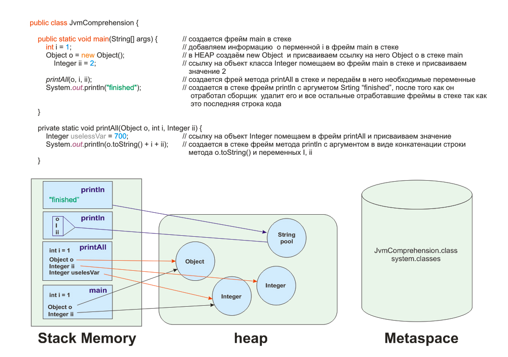
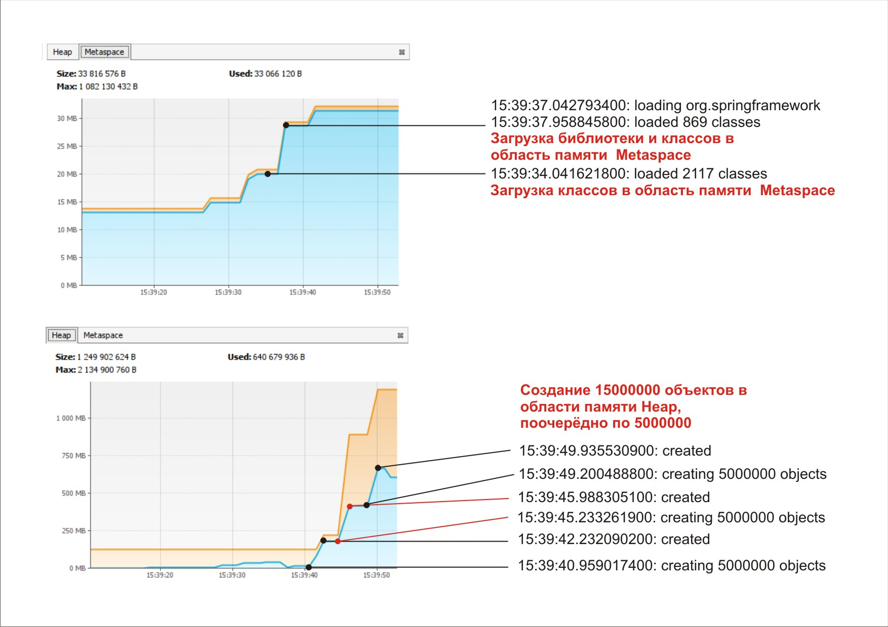

# Задача 1.  "Понимание JVM"


Пример кода

```
public class JvmComprehension {

    public static void main(String[] args) {
        int i = 1;                      	 // 1
        Object o = new Object();       	 // 2
        Integer ii = 2;                	 // 3
        printAll(o, i, ii);            		 // 4
        System.out.println("finished");	 // 7
    }

    private static void printAll(Object o, int i, Integer ii) {
        Integer uselessVar = 700;                   // 5
        System.out.println(o.toString() + i + ii);  // 6
    }
}

```

JVM через ClassLoader загружает системные классы и класс JvmComprehension в область памяти Metaspace далее происходит связывание  
Linking  проверка на корректность написания класса и если всё верно, последним этапом происходит  инициализация 

Создаем фрейм метода main в стек памяти
1. добавляем информацию  о переменной i в фрейм main в стеке
2. в HEAP создаём new Object  и присваиваем ссылку на него Object o в стеке main
3. ссылку на объект класса Integer помещаем во фрейм main в стеке и присваиваем значение 2
4. создается фрей метода printAll в стеке и передаём в него необходимые переменные
5. ссылку на объект Integer помещаем в фрейм printAll и присваиваем значение
6. создается в стеке фрейм метода println с аргументом в виде конкатенации строки метода o.toString() и переменных I, ii
7. создается в стеке фрейм println с аргументом Srting “finished”, после того как он отработал сборщик  удалит его и все остальные  
отработавшие фреймы в стеке так как это последняя строка кода

    

# Схема к задаче




# Задача 2.  "Исследование JVM через VisualVM"

Анализ графиков

В первой части программы происходит создание большого количества классов, что соответственно заполняет область памяти Metaspace
Во второй части происходит создание большого количества объектов, что хорошо видно на графике заполнения области памяти Heap

